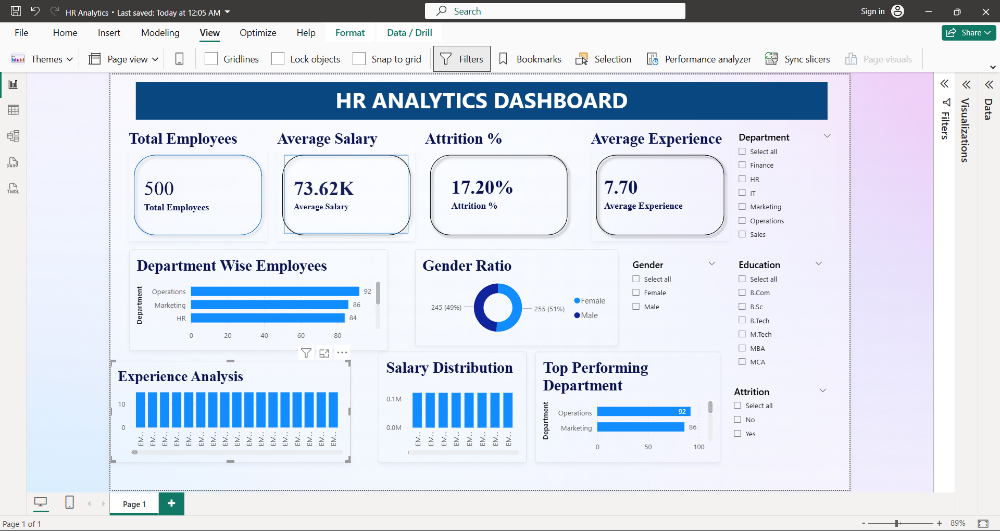

# HR-Analytics-Dashboard-PowerBI
Interactive HR Analytics Dashboard built using Power BI to analyze employee performance, attrition, salary distribution, and workforce insights.

## Project Overview
This project is an interactive HR Analytics Dashboard built using Microsoft Power BI.

## Dashboard Preview

## Objectives
- Analyze employee data
- Monitor attrition
- Compare departments
- Analyze salary trends
- Analyze experience levels

## Tools Used
- Power BI
- Power Query
- DAX
- Microsoft Excel

## Dashboard Features
- Total Employees
- Average Salary
- Attrition %
- Average Experience
- Department-wise Employees
- Gender Ratio
- Salary Distribution
- Top Performing Departments
- Interactive Slicers

## Key Performance Indicators (KPIs)
- 👥 Total Employees: 500
- 💰 Average Salary: 73.62K
- 📉 Attrition Rate: 17.20%
- ⭐ Average Experience: 7.70 Years
  
## Key Insights
- Total Employees: 500
- Attrition Rate: 17.2%
- Average Salary: 73.62K
- Average Experience: 7.7 Years

## Skills Demonstrated
- Data Cleaning
- Data Visualization
- Dashboard Development
- DAX
- Business Intelligence

